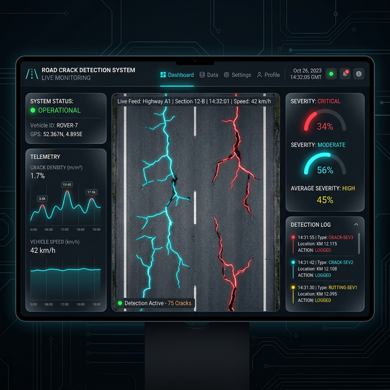

# Road Crack Detection (DIP Based Project)



This project implements a comprehensive road crack detection system using Digital Image Processing (DIP) techniques. It provides solutions for both static image analysis and real-time monitoring via IP camera streams.


---

## 📥 Project Inputs

The system accepts two primary forms of input based on the detection mode:

### 1. Static Image Input
- **Format**: Supported image formats include `.jpg`, `.jpeg`, and `.png`.
- **Source**: A local directory containing road surface images.
- **Example Directory**: `sample_road_crack_images_for_static_detection/`
- **User Action**: Update the `folder_path` variable in the static scripts to point to your image folder.

### 2. Real-Time Video Input
- **Source**: IP Camera video stream URL.
- **Example URL**: `http://192.168.x.x:4747/video` (Commonly used with mobile apps like "IP Webcam").
- **User Action**: Update the `ip_camera_url` variable in `ROAD_CRACK_DETECTION_REALTIME.py`.

---

## 📤 Project Outputs

The scripts provide detailed visual and data-driven outputs to analyze crack severity.

### 1. Static Detection Output (Standard & Enhanced)
The static scripts generate a multi-panel visualization (using Matplotlib) showing the transformation stages:
- **Original Image**: The raw input photo.
- **Grayscale & Denoised**: Noise reduction stages using Gaussian Blur or Non-Local Means Denoising.
- **Enhanced Contrast**: Contrast Limited Adaptive Histogram Equalization (CLAHE).
- **Edge Detection**: Canny Edge Detection results.
- **Texture Enhancement**: Gabor Filtering to highlight crack-like patterns.
- **Morphological Operations**: Morphological Closing to bridge gaps in detected crack segments.
- **Thresholding**: Otsu’s and Adaptive Thresholding for binary segmentation.
- **Final Overlay**: Detected cracks highlighted in their original context.

### 2. Real-Time Detection Output
The real-time script displays a live window with:
- **Visual Overlay**: Detected cracks are highlighted in **red** directly on the live feed.
- **Crack Length Measurement**: The system calculates the **arc length** (in pixels) for each detected crack and displays the label (e.g., `L: 245.50 px`) near the crack.
- **6-Panel Monitoring Grid**:
  1. Original Feed
  2. Grayscale Feed
  3. Histogram Equalization
  4. Canny Edges
  5. Live Overlay with Labels
  6. Real-time Intensity Histogram

---

## 🛠️ DIP Techniques Used
- **Denoising**: Non-Local Means Denoising.
- **Enhancement**: CLAHE (Contrast Limited Adaptive Histogram Equalization).
- **Edge Detection**: Canny Edge Algorithm.
- **Feature Extraction**: Gabor Filters.
- **Segmentation**: Otsu’s Binarization & Adaptive Thresholding.
- **Shape Analysis**: Morphological Transformations (Top-Hat, Bottom-Hat, Closing).

---

## 🚀 How to Run

1.  **Clone the Repository**:
    ```bash
    git clone https://github.com/prasanna-025/Road_Crack_Detection_DIP_based_Project.git
    cd Road_Crack_Detection_DIP_based_Project
    ```
2.  **Install Dependencies**:
    ```bash
    pip install opencv-python numpy matplotlib
    ```
3.  **Run Static Detection**:
    ```bash
    python ROAD_CRACK_DETECTION_STATIC.py
    ```
4.  **Run Real-Time Detection**:
    (Ensure your IP camera is active and the URL is updated in the script)
    ```bash
    python ROAD_CRACK_DETECTION_REALTIME.py
    ```
5.  **Run Modern GUI Dashboard**:
    (Provides a professional integrated interface)
    ```bash
    python ROAD_CRACK_GUI_DASHBOARD.py
    ```

---

## 📊 Sample Images
Sample road images for testing are available in the `sample_road_crack_images_for_static_detection` folder.
